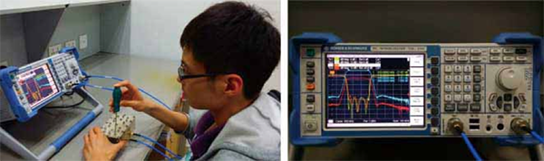
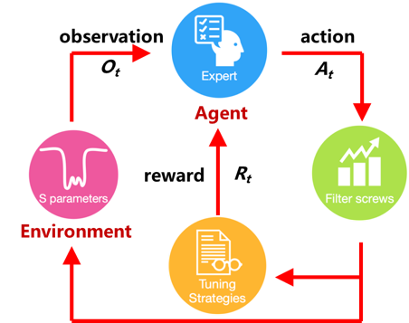

---
## INTRODUCTION

&emsp;&emsp;Microwave cavity filters are in great demand in satellite communication industry, mobile communication industry, radar systems and electronic countermeasures systems. Especially the recent fast growing rate of mobile communication industry makes it more pressing in solving the problem restricting the development of microwave cavity filters. Because of the imprecisions in manufacturing and assembling processes, each cavity filter should be carefully tuned by a professional technician before leaving the factory. This operation is completed by manually tuning the screws and adjusting the screw nuts to fit the scattering characteristics (or S-parameters) shown in the vector network analyzer to the design specifications (Fig 1).

Fig.1. Manually tuning of cavity filters by human experts. 

&emsp;&emsp;The complicated and nonlinear relationship between the S-parameters and the screw positions of the cavity filters makes the tuning process difficult and time-consuming. The tuning speed not only depends on the specific type and structure of the filters, but also highlights the importance of human roles in the tuning operation. The tuning time varies with different human experience and strategies from several minutes to several hours. This improvement of the production efficiency severely be restricted by lacking of experienced technicians, who are always expensive to train and employ.
&emsp;&emsp;Over time, the automation reformation of the cavity filter tuning tasks seems particularly important and urgent. On the one hand, the manually tuning of filters consumes much time, slowing down the production efficiency of the enterprises. On the other hand, fewer and fewer young people tend to dot these dull and repetitive tasks. 
&emsp;&emsp;Hence, we proposed a new tuning method based on the mechanism of reward and penalty, which is the key of the *reinforcement learning (RL)*. A single layer feedforward neural network is built to model the value function for *Q-learning*.

---

## PUBLICATIONS 

The project is described in the following paper:
[[1] Reinforcement Learning Approach to Learning Human Experience in Tuning Cavity Filters, IEEE 2015 ROBIO.](https://doi.org/10.1109/ROBIO.2015.7419091)
[[2] IntelligentTuningAlgorithmofCavityFilterandTuningMethodUsingSame,PatentNo.CN105680827A.](http://www.google.com/patents/CN105680827A?cl=en)

---

## INTELLIGENT TUNING BASED ON Q-LEARNING 

&emsp;&emsp;[*Reinforcement Learning*](https://en.wikipedia.org/wiki/Reinforcement_learning) is an area of machine leanring inspired by behaviorist psychology, concerned with how *software agents* ought to take actions in an *environment* so as to maximize some notion of cumulative *reward*. Similary, when the worker tuned filter, he adjusted the position of screw according to changing S-parameters untill satisfy the requirement (shown in **Fig. 1**). We learned hence a model which based on reinforcement learning to finish tuning the filter. 

**Fig.2** The process of filter tuning. 

> **Algorithm**
>
>1. Initialize replay memory *D* to capacity N
>2. Initialize action-value function *Q* with random weights *w* and biases *b*
>3. Initialize target action-value function \\(Q\_{target}\\) with weights \\(w\_{t} = w\\)
>4. **For** *episode* = 1, *M* **do**
>5. &emsp;&emsp;Initialize sequence \\(s\_{t}\\) (S-parameters) 
>6. &emsp;&emsp;**For** *t* = 1, *T* **do**
>7. &emsp;&emsp;&emsp;&emsp;With probability *e* select *a* random action \\(a\_{t}\\)
>8. &emsp;&emsp;&emsp;&emsp;Execute action \\(a\_{t}\\) in filter tuning and observe reward \\(r\_{t}\\) and \\(s\_{t+1}\\)
>9. &emsp;&emsp;&emsp;&emsp;Store transition \\((s\_{t}, a\_{t}, r\_{t}, s\_{t+1})\\) in *D*
>10. &emsp;&emsp;&emsp;&emsp;Sample random minibatch of transitions from *D*
>11. &emsp;&emsp;&emsp;&emsp;Compute \\( y\_{t}= r\_{t} + \max \_{a\_{t+1}}Q'(s\_{t+1},a\_{t+1};w,b) \\)
>12. &emsp;&emsp;&emsp;&emsp;Perform a gradient descent to update *w*, *b*
>13. &emsp;**end for**
>14. **end for**

---

## RESULT

<iframe width="560" height="315" src="https://www.youtube.com/embed/WI7qOMQl9z0" frameborder="0" allowfullscreen></iframe>

&emsp;&emsp;We trained the *Q-network* for 100 epochs, each with 1000 maximum tuning steps. As can be seen from the results, at the beginning of the training process the *Q-network* model seemed hard to achieve the desired state and failed the tuning after 1000 frames (tuning steps). As the training proceeded the step for successfully tuning gradually decreased and converged to about 100 times. After 100 training epochs, we tested the trained Q-network with 100 random states and we found that the probability of successfully tuning reached 95% and in most of the cases the filter could be tuned out within only 50 steps.

---

**[The Code](https://github.com/ioaniu/Intelligent-Tuning-of-Cavity-Filter)**
